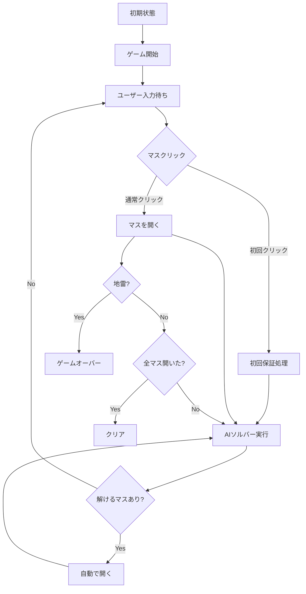

# 「AIにネタバレされるマインスイーパー」技術設計書

## 1. 技術スタック

### 選定技術
- **言語**: Go 1.21+
- **TUIライブラリ**: [Bubble Tea](https://github.com/charmbracelet/bubbletea)
- **スタイリング**: [Lip Gloss](https://github.com/charmbracelet/lipgloss)
- **ビルドツール**: Go Modules

### 選定理由
- **Go**: 高速な実行速度でAIソルバーの瞬間的な処理を実現
- **Bubble Tea**: Elmアーキテクチャベースの直感的なTUI開発
- **Lip Gloss**: ターミナルでもリッチな見た目を実現

## 2. アーキテクチャ設計

### ディレクトリ構造
```
ai-minesweeper/
├── main.go              # エントリーポイント
├── game/
│   ├── board.go         # 盤面のデータ構造と操作
│   ├── cell.go          # セルの状態管理
│   └── game.go          # ゲームロジック全体
├── solver/
│   ├── solver.go        # AIソルバーのメインロジック
│   └── analyzer.go      # 盤面分析アルゴリズム
├── tui/
│   ├── model.go         # Bubble Teaのモデル定義
│   ├── view.go          # 画面描画ロジック
│   ├── update.go        # イベントハンドリング
│   └── styles.go        # Lip Glossスタイル定義
└── go.mod
```

### モジュール設計

#### game パッケージ
```go
// Cell: 各マスの状態
type Cell struct {
    IsMine     bool
    IsRevealed bool
    IsFlagged  bool
    Adjacent   int  // 隣接する地雷数
}

// Board: ゲーム盤面
type Board struct {
    Width  int
    Height int
    Mines  int
    Cells  [][]Cell
}

// GameState: ゲーム全体の状態
type GameState int
const (
    Playing GameState = iota
    Won
    Lost
)

// Game: ゲーム全体を管理
type Game struct {
    Board      *Board
    State      GameState
    FirstClick bool
}
```

#### solver パッケージ
```go
// SolverResult: AIソルバーの結果
type SolverResult struct {
    SafeCells    []Position  // 確定安全マス
    MineCells    []Position  // 確定地雷マス
    CanProgress  bool        // まだ論理的に解けるか
}

// Solver: AIソルバー
type Solver struct {
    board *game.Board
}
```

#### tui パッケージ
```go
// Model: Bubble Teaのモデル
type Model struct {
    game       *game.Game
    solver     *solver.Solver
    cursor     Position
    aiThinking bool
}
```

## 3. 詳細設計

### AIソルバーアルゴリズム

#### 基本戦略
1. **シングルポイント解析**: 各数字マスの周囲を個別に分析
2. **制約伝播**: 確定情報を使って他のマスの状態を推論
3. **パターンマッチング**: よくあるパターンを認識して高速化

#### 実装の流れ
```go
func (s *Solver) Solve() SolverResult {
    changed := true
    
    for changed {
        changed = false
        
        // 1. 確定地雷を特定
        mines := s.findDefiniteMines()
        changed = changed || len(mines) > 0
        
        // 2. 確定安全マスを特定
        safes := s.findDefiniteSafeCells()
        changed = changed || len(safes) > 0
        
        // 3. 見つかった安全マスを仮想的に開く
        for _, pos := range safes {
            s.virtualReveal(pos)
        }
    }
    
    return SolverResult{
        SafeCells:   s.collectedSafeCells,
        MineCells:   s.collectedMineCells,
        CanProgress: len(s.collectedSafeCells) > 0,
    }
}
```

### TUI設計

#### 画面レイアウト
```
┌─────────────────────────────────┐
│  AI Minesweeper - Spoiled by AI │
├─────────────────────────────────┤
│  Mines: 10  Time: 00:42         │
├─────────────────────────────────┤
│  ┌─┬─┬─┬─┬─┬─┬─┬─┐             │
│  │▓│▓│▓│2│1│▓│▓│▓│             │
│  ├─┼─┼─┼─┼─┼─┼─┼─┤             │
│  │▓│▓│2│█│█│2│▓│▓│ ← cursor    │
│  ├─┼─┼─┼─┼─┼─┼─┼─┤             │
│  │1│1│1│█│█│1│1│1│             │
│  └─┴─┴─┴─┴─┴─┴─┴─┘             │
├─────────────────────────────────┤
│  [↑↓←→] Move  [Space] Reveal    │
│  [f] Flag     [r] New Game      │
└─────────────────────────────────┘
```

#### キー操作
- **矢印キー**: カーソル移動
- **スペース**: マスを開く
- **f**: 旗を立てる/外す（表示のみ、AIは使用）
- **r**: 新しいゲーム
- **q**: 終了

### 状態遷移



## 4. パフォーマンス考慮

### AIソルバーの高速化
- **ビットボード**: 盤面状態をビット演算で管理
- **差分更新**: 前回の解析結果を再利用
- **早期終了**: 解けるマスが見つかり次第、即座に返す

### TUIの応答性
- **非同期処理**: AIソルバーは別goroutineで実行
- **バッファリング**: 描画更新を適切にバッファリング
- **最小再描画**: 変更部分のみを再描画

## 5. 実装優先順位

1. **Phase 1**: 最小限の動作するゲーム
   - 基本的な盤面生成と表示
   - マスを開く機能
   - ゲームオーバー/クリア判定

2. **Phase 2**: AIソルバー統合
   - 基本的な論理解析
   - 自動開封機能

3. **Phase 3**: UX改善
   - アニメーション効果
   - 難易度選択
   - 統計情報表示

## 6. テスト戦略

### ユニットテスト
- `game`パッケージ: 盤面操作の正確性
- `solver`パッケージ: 様々なパターンでの解析精度

### 統合テスト
- ゲーム全体のフロー
- AIとユーザー操作の連携

### パフォーマンステスト
- 大きな盤面でのAIソルバー速度
- TUIの描画パフォーマンス